# AssembleYourMoped
Симулятор сборки мопеда на Unity. Вдохновлён My Summer Car: разбирай, чини и собирай мопед по деталям.

# AssembleYourMoped (Собери свой мопед) 🛠️

3D-симулятор сборки мопеда на Unity, вдохновлённый My Summer Car.

## О проекте
Игрок получает разобранный мопед и должен собрать его из отдельных 
деталей: двигатель, рама, карбюратор, проводка и т.д. 
Каждая деталь имеет физику и точки крепления.

## Скриншоты
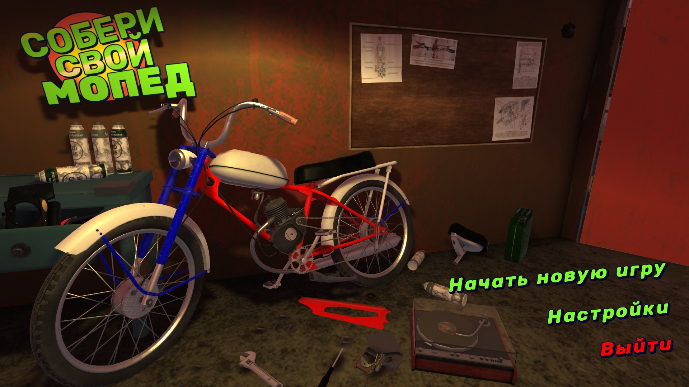
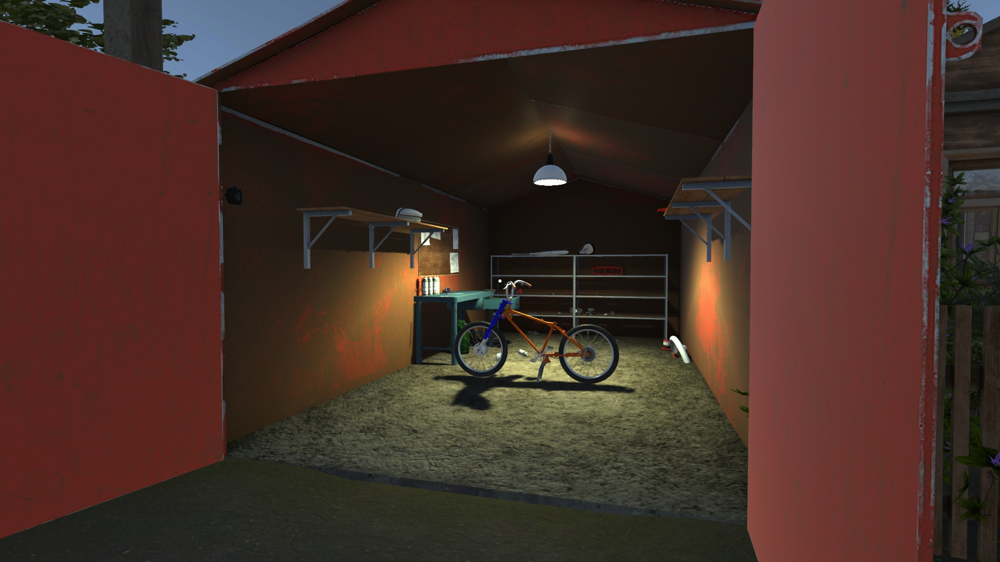

| Пример геймплея | Пример геймплея |
|---|---|
| 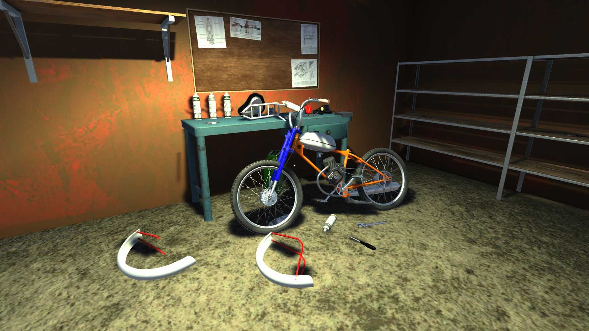 | 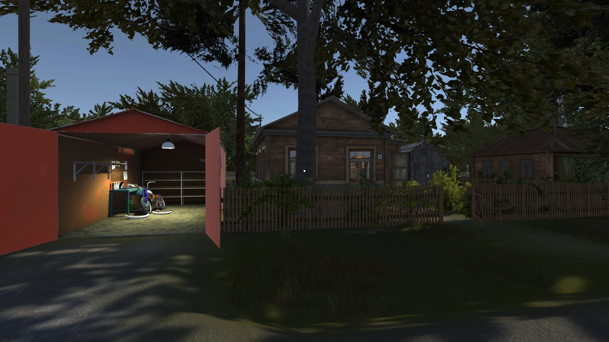 |

## GIF
### Мир и атмосфера
| Смена дня и ночи | Езда |
|---|---|
| 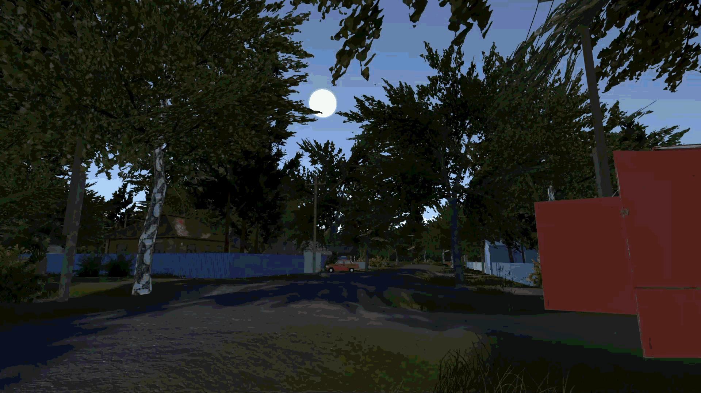 | 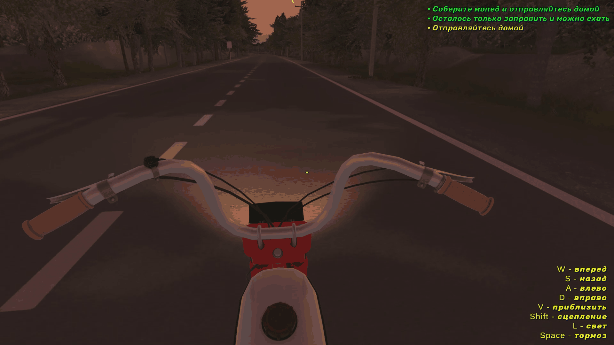 |

### Геймплей
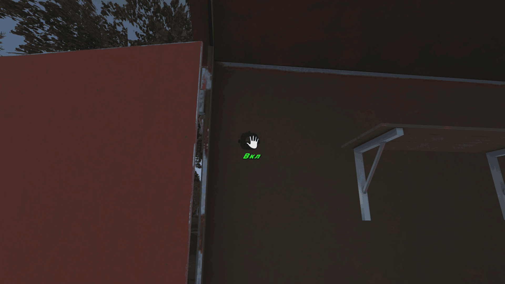

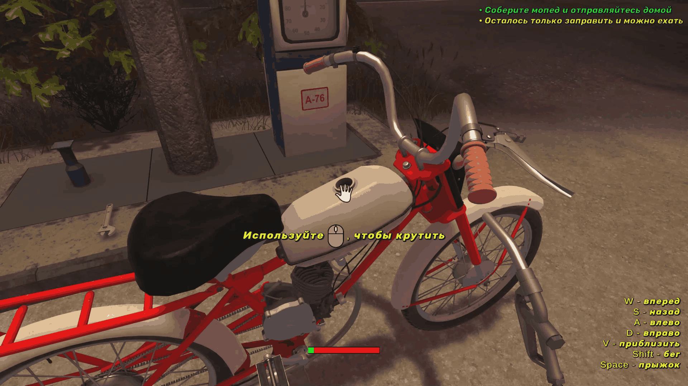

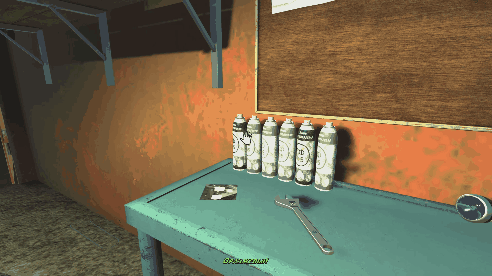

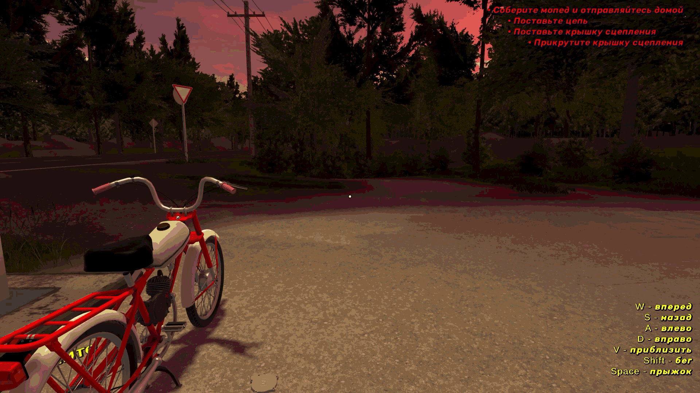

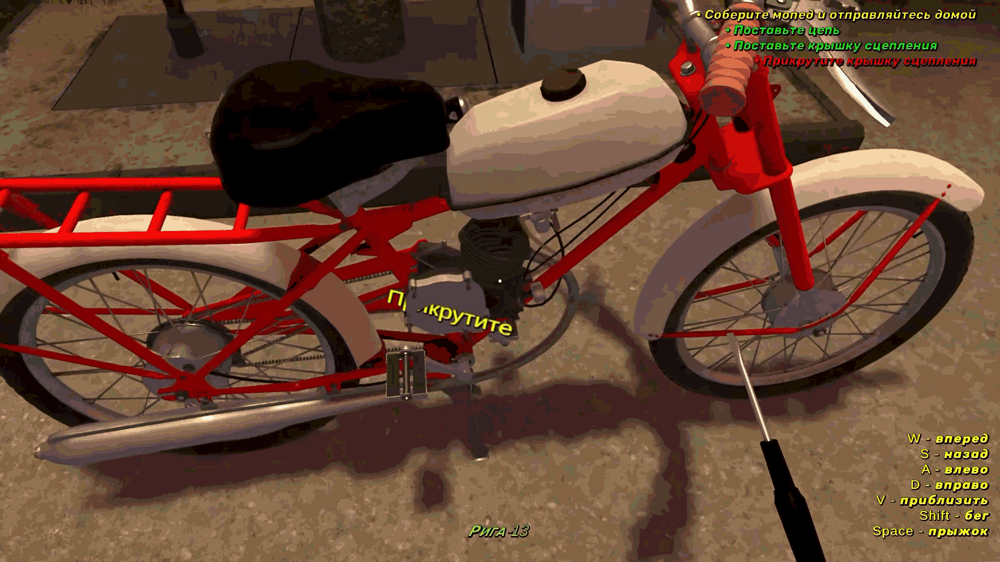

## Реализованные механики
- Система крепления деталей (болты, точки соединения)
- Система покраски деталей (рама, крылья и тп)
- Система смены дня и ночи
- Система инструментов (ключ закручивает гайки, отвертка - болты)
- Физика деталей и взаимодействие через Rigidbody
- Перетаскивание объектов
- UI: подсказки, чек-лист сборки

## Технологии
- Unity 2022.3 LTS
- C#
- Universal Render Pipeline (URP)
- Cinemachine
- TextMeshPro

## Управление
| Действие | Клавиша |
|----------|---------|
| Движение | WASD |
| Взаимодействие / Взять деталь | ЛКМ |
| Использовать инструмент | ПКМ |
| Поворот детали | Колесо |

## Как запустить
1. Клонировать репозиторий
2. Открыть проект в Unity 2022.3 LTS
3. Открыть сцену `Assets/Scenes/MainScene.unity`
4. Нажать Play

## Статус проекта
🚧 В разработке.

**Реализовано:** сборка/разборка деталей, покраска, инструменты, 
смена дня и ночи, езда, звуки двигателя, система работы двигателя, настройка карбюратора, выхлопная система, анимации мопеда.

**В планах:** система износа деталей,  
сохранение прогресса, больше мопедов внутриигровые задания, валюта, персонажи.